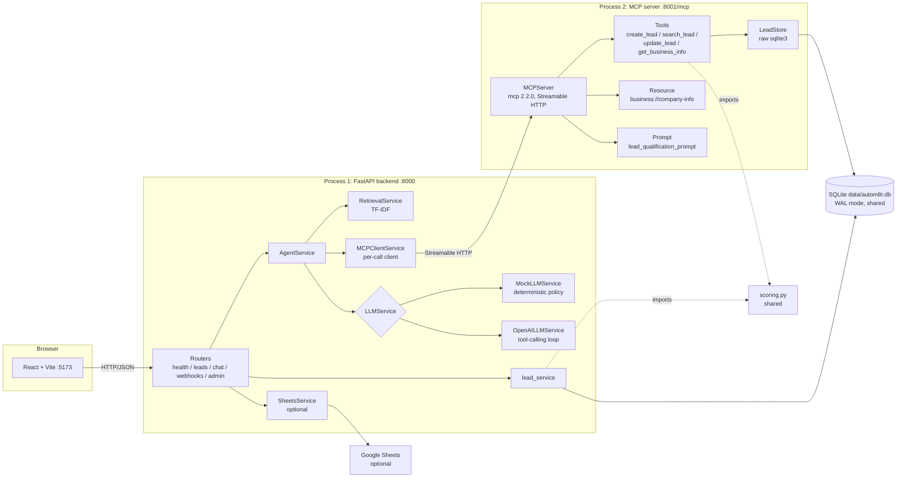

# Autom8r Architecture

Autom8r is a working demonstration platform for AI-powered lead qualification
and customer support automation. It is not a production system and does not
claim to be. It is a small, honest, fully tested reference implementation
that shows how a React frontend, a FastAPI backend, an AI agent, and an MCP
tool server fit together in one repo.

This document traces the full request path and explains every significant
technology decision in a WHY / WHAT / HOW / TRADEOFF format.

Verified stack (as installed): Python 3.13.9, FastAPI 0.141.1, Pydantic
2.13.5, SQLAlchemy 2.0.54, openai 3.16.1, mcp 2.2.0, uvicorn 0.53.0.

---

## The big picture

```
                                    Autom8r (one repo, two Python processes)

  +---------------------+
  |  Browser            |
  |  React + Vite dev   |        frontend/ is a scaffold (src/components,
  |  server :5173       |        src/services, src/types) built against
  +----------+----------+        docs/api-contract.md
             |
             | HTTP/JSON (CORS allow-listed origin http://localhost:5173)
             v
  +---------------------+  PROCESS 1: backend (uvicorn app.main:app :8000)
  |  FastAPI app        |
  |  app/main.py        |
  |                     |
  |  Routers:           |     Services (app/services/):
  |   /health           |      AgentService ......... chat turn orchestrator
  |   /api/v1/leads     |      RetrievalService .... TF-IDF over data/knowledge/*.md
  |   /api/v1/chat      |      LLMService .......... MockLLMService (default)
  |   /api/v1/webhooks  |                         or OpenAILLMService (live)
  |   /api/v1/admin     |      MCPClientService .... per-call MCP client
  |                     |      lead_service ........ CRUD + scoring integration
  |  SQLAlchemy ORM     |      SheetsService ....... optional Google Sheets sync
  +----+-----------+----+
       |           |
       | SQL       | Streamable HTTP (per-call session)
       v           v
  +---------+   +---------------------+  PROCESS 2: MCP server
  | SQLite  |   |  MCPServer (mcp     |  (python -m mcp_server.server :8001)
  | WAL     |   |  2.2.0) at /mcp     |
  | data/   |   |                     |
  | autom8r |   |  Tools: create_lead,|     Reads/writes the SAME SQLite
  | .db     |<--|  search_lead,       |     file with raw sqlite3 SQL
  +---------+   |  update_lead,       |     (WAL makes sharing safe)
       ^        |  get_business_info  |
       |        |  Resource: business://company-info
       |        |  Prompt: lead_qualification_prompt
       |        +----------+----------+
       |                   |
       |                   v
       |        shared scoring module
       |        backend/app/services/scoring.py (pure stdlib)
       |
       +-- optional: Google Sheets append (best-effort, off by default)
```



---

## One chat request, end to end

The most interesting path is `POST /api/v1/chat`. Numbered steps, each
mapped to the code that runs it:

1. The browser posts `{ "message": "...", "history": [...] }` to
   `http://localhost:8000/api/v1/chat`. The server is stateless: the client
   keeps the conversation and resends it every turn
   (`backend/app/schemas/chat.py`, `ChatRequest`).
2. FastAPI parses the body into `ChatRequest` (Pydantic v2). A bad payload
   never reaches the route; the global handler in `app/main.py` returns the
   standard 422 error envelope.
3. `chat.py` hands the request to `AgentService.handle_chat`
   (`backend/app/services/agent_service.py`).
4. `RetrievalService.retrieve(message, top_k=3)` scores the message against
   TF-IDF vectors of the Markdown knowledge chunks in `data/knowledge/`
   (`retrieval_service.py`). A top score of 0.15 or higher counts as a
   strong match (`RETRIEVAL_THRESHOLD`).
5. `accumulate_extraction(message, history)` re-derives all lead fields
   (name, phone, business type, ...) from every user turn so far
   (`llm_service.py` + `extraction.py`).
6. The LLM decides the next action. In the default mock mode,
   `MockLLMService.decide` runs a deterministic policy (answer from
   knowledge, ask the next question, or call a tool). In live mode,
   `OpenAILLMService` runs an OpenAI-compatible tool-calling loop capped at
   `MAX_TOOL_ROUNDS = 3`.
7. When the decision is a tool call, `MCPClientService.call_tool` opens a
   short-lived Streamable HTTP session to `http://127.0.0.1:8001/mcp`,
   invokes the tool, and closes the session (`mcp_client_service.py`).
8. The MCP server (`mcp_server/server.py`, `MCPServer` from mcp 2.2.0)
   executes the tool. Lead tools read and write the shared SQLite file
   through `LeadStore` (`mcp_server/db.py`, raw parameterized SQL) and score
   the lead with the shared `scoring.py` module.
9. The agent composes the reply (a confirmation built from the tool result
   in mock mode, or the model's final message in live mode) and returns
   `ChatResponse`: `reply`, `lead`, `tool_activity`, `retrieval_used`,
   `llm_mode`.
10. The REST CRUD path (`/api/v1/leads`) is simpler: router ->
    `lead_service` -> SQLAlchemy ORM -> the same SQLite file. Because both
    processes open the database in WAL mode with a 15 second busy timeout,
    the two processes share one file without "database is locked" errors.

---

## Technology decisions

### SQLite (in WAL mode) as the database

- **WHY:** the demo must run on a fresh machine with zero services to
  install. SQLite is a single file with no server process, and it is in the
  Python standard library.
- **WHAT:** one file, `data/autom8r.db`, holding the `leads` and
  `webhook_events` tables. Two processes (backend and MCP server) read and
  write it concurrently.
- **HOW:** both sides enable Write-Ahead Logging (`PRAGMA journal_mode=WAL`)
  and a busy timeout (`PRAGMA busy_timeout=15000`, also passed as
  `timeout=15` to the connections). WAL lets readers and one writer work at
  the same time instead of taking a whole-database lock, which is what
  prevents "database is locked" between the two processes. The backend sets
  the pragmas on every new SQLAlchemy connection (`app/db/database.py`); the
  MCP server sets them on every raw connection (`mcp_server/db.py`).
- **TRADEOFF:** SQLite is one file on one machine. A multi-instance
  deployment would move to a client/server database such as PostgreSQL; the
  SQLAlchemy URL in `DATABASE_URL` is the single place that would change on
  the backend side.

### FastAPI for the HTTP API

- **WHY:** the contract between frontend and backend must be explicit and
  machine-checked. FastAPI builds request parsing, validation, and OpenAPI
  docs directly on Pydantic models, so the schema in code IS the contract.
- **WHAT:** an async ASGI app (`app/main.py`) with five routers, CORS
  middleware, a request-logging middleware, and three global exception
  handlers that produce one predictable error envelope
  (`{"success": false, "error": {"code", "message"}}`).
- **HOW:** routes declare typed Pydantic models (`app/schemas/`); FastAPI
  validates before the route runs and rejects bad payloads with 422. Typed
  application errors (`app/utils/errors.py`) carry their HTTP status and
  machine-readable code, so no route builds error JSON by hand. Interactive
  docs are at `/docs` when the server runs.
- **TRADEOFF:** FastAPI adds a framework dependency versus a hand-rolled
  stdlib server, and async code has a learning curve. For an API whose
  payload shapes are the whole point, the built-in validation pays for
  itself immediately.

### MCP as a separate process

- **WHY:** this is how MCP is used for real. A tool server that any MCP host
  can reach (this backend, an IDE, Claude Desktop) is far more useful than
  tools bolted inside one web app, and the project exists to teach that
  boundary.
- **WHAT:** `mcp_server/` is a standalone process running `MCPServer` (from
  `mcp.server.mcpserver`, mcp 2.2.0) over Streamable HTTP at
  `http://127.0.0.1:8001/mcp`. It exposes four tools, one resource, and one
  prompt.
- **HOW:** `python -m mcp_server.server` from the repo root starts it
  (`MCP_HOST` / `MCP_PORT` env vars override the defaults). The backend
  never imports the tools; it discovers and calls them over the protocol
  through `MCPClientService`. The two processes share the SQLite file
  safely thanks to WAL, and they share scoring logic by importing the pure
  stdlib `backend/app/services/scoring.py` module (the repo root is put on
  `sys.path` in `server.py` so this works however the server is launched).
- **TRADEOFF:** one extra process to start locally, and two data-access
  styles to keep in sync (ORM on the backend, raw SQL in the MCP server).
  The column drift risk is pinned by a test
  (`mcp_server/tests/test_server.py::test_schema_columns_match_backend_orm`),
  and the datetime storage format `'YYYY-MM-DD HH:MM:SS.ffffff'` is a
  documented shared contract so rows written by either side read correctly
  on the other.

### TF-IDF retrieval instead of embeddings or a vector database

- **WHY:** the retrieval layer must install anywhere (including a fresh
  Windows machine with no compiler), behave deterministically in tests, and
  be honest about what it is: keyword retrieval, not semantic search.
- **WHAT:** `RetrievalService` chunks the three Markdown files in
  `data/knowledge/` on `## ` headings, builds TF-IDF vectors with pure
  Python (`math` + `re`), and ranks chunks by cosine similarity.
- **HOW:** tokenize with `[a-z0-9]+`, compute smoothed IDF
  (`log((1 + N) / (1 + df)) + 1`), weight term frequency by IDF, and compare
  sparse vectors with cosine similarity. Results with score 0 are dropped;
  the agent treats a top score below 0.15 as "no knowledge".
- **TRADEOFF:** paraphrases that share no keywords ("money back" vs
  "refund") score lower than they would with embeddings. That is an accepted
  limitation for a demo. `docs/rag-explanation.md` shows how an
  `EmbeddingRetriever` could replace this class behind the same
  `retrieve(query, top_k)` interface without touching the agent.

### A deterministic mock LLM as the default

- **WHY:** the whole system must run, demo, and test with no API key, no
  network, and no cost. Tests also need reproducible behavior, which a live
  model cannot give.
- **WHAT:** `MockLLMService` implements the same `LLMService` protocol as
  the live `OpenAILLMService`. It is NOT a canned-response chatbot: it runs
  the same extraction, retrieval, and MCP tool-call flow as live mode, with
  a deterministic policy (intent checks, accumulated fields, next-question
  ordering) in place of the model.
- **HOW:** `build_llm_service(settings)` returns the live service only when
  `LLM_ENABLED=true` AND `LLM_API_KEY` is set; otherwise it returns the
  mock. The health endpoint and every chat response report `llm_mode` so the
  UI can badge "Mock LLM" honestly. In live mode, any LLM failure degrades
  to the mock for that turn rather than failing the request.
- **TRADEOFF:** the mock only handles the intents it knows (qualification,
  search, update, business info, knowledge questions). It cannot hold a
  free-form conversation. That is the correct trade for a demo whose purpose
  is to show the plumbing, not to impress with chit-chat.

### Per-call MCP connections

- **WHY:** statelessness is crash-proof. If the MCP server restarts, there
  is no stale pooled session for the backend to trip over, and the demo's
  call rate is at most one tool call per chat turn.
- **WHAT:** every `list_tools` / `call_tool` opens a fresh
  `async with Client(self._base_url)` Streamable HTTP session, does its
  work, and closes (`mcp_client_service.py`).
- **HOW:** the official `mcp.client.Client` handles the protocol handshake
  per session. Any SDK or transport failure is converted to
  `MCPUnavailableError` (HTTP 503), and a tool that ran but reported failure
  becomes `MCPToolError` (HTTP 502), so routes and the agent degrade
  cleanly.
- **TRADEOFF:** a few milliseconds of handshake per call versus a persistent
  session pool. At production call rates you would keep a pooled session;
  the `MCPClientLike` protocol means only this one class would change.

### Two data-access styles on one schema (deliberate teaching contrast)

- **WHY:** the repo demonstrates both idioms a Python developer meets:
  ORM-style and raw-SQL-style.
- **WHAT:** the backend uses SQLAlchemy 2.0 ORM (`Mapped` /
  `mapped_column`); the MCP server uses stdlib `sqlite3` with parameterized
  queries.
- **HOW:** both write the same columns in the same datetime storage format.
  A test pins the column list so schema drift fails loudly.
- **TRADEOFF:** the DDL in `mcp_server/db.py` must stay in sync with
  `backend/app/models/lead.py` by hand. The drift-guard test is the safety
  net.

### Centralized configuration with pydantic-settings

- **WHY:** a typo in an environment variable name should fail fast at boot,
  not at midnight.
- **WHAT:** every env var the backend understands is declared once in
  `app/config.py` (`Settings`). Nothing else in the codebase reads
  `os.environ` directly.
- **HOW:** `BaseSettings` parses the environment plus an optional
  `backend/.env` file into a typed object at import time. Derived values
  (the default SQLite path, the CORS origin list, `llm_mode`) are computed
  in one place.
- **TRADEOFF:** one extra dependency versus hand-rolled `os.getenv` parsing.

---

## Processes, ports, and configuration

| Process  | Command (from repo root unless noted)        | Port | Config source            |
|----------|----------------------------------------------|------|--------------------------|
| Frontend | Vite dev server (scaffold)                   | 5173 | `VITE_API_BASE_URL`      |
| Backend  | `uvicorn app.main:app --reload --port 8000` (from `backend/`) | 8000 | `backend/.env` (see `backend/.env.example`) |
| MCP server | `python -m mcp_server.server`              | 8001 | `MCP_HOST`, `MCP_PORT`, `AUTOM8R_DB_PATH` |

Both Python processes share `data/autom8r.db` (WAL). The backend talks to
the MCP server at `MCP_SERVER_URL` (default `http://127.0.0.1:8001/mcp`).
CORS allows only the origins in `CORS_ORIGINS` (default
`http://localhost:5173`).

## What this architecture deliberately does not do

No authentication on `/api/v1/chat` (a website visitor must be able to
chat), no rate limiting, no persistent MCP session pool, no embedding model,
no message queue. Each omission is a conscious demo-scope decision with the
production alternative documented where it matters (this file,
`docs/rag-explanation.md`, and the module docstrings).
